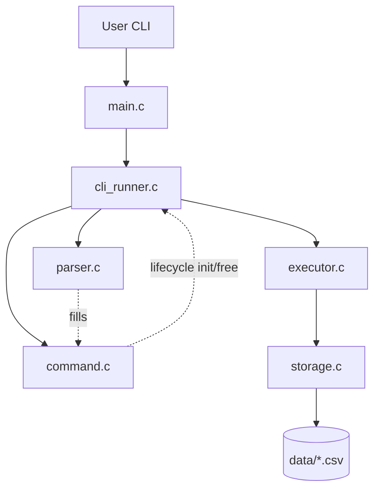
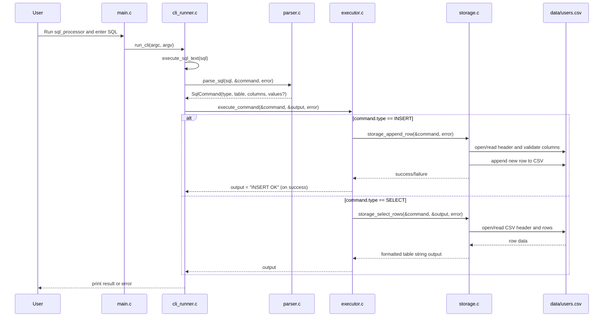

# Jungle SQL Processor

이 프로젝트는 수요코딩회 과제인 **SQL 처리기(Processor) 구현**을 목표로 만든 C 언어 프로젝트입니다.
텍스트 파일로 작성된 SQL 문을 CLI로 전달받아 파싱하고, 실행하고, 파일에 저장하는 전체 흐름을 구현했습니다.

## 주요 기능

`SQL 파일 입력 처리` `interactive SQL 입력 처리` `INSERT 지원` `SELECT 지원` `CSV 파일 기반 데이터 저장/조회` `SELECT 결과 표 형식 출력` `단위 테스트 및 통합 테스트 제공`

## 지원하지 않는 기능

`CREATE TABLE` `UPDATE` `DELETE` `JOIN` `WHERE` `트랜잭션` `별도 스키마 메타데이터` `타입 검증`

## 동작 방식

**전체 처리 흐름**

```
main  -->  run_cli  -->  command(init)  -->  parser  -->  executor  -->  storage -->  command(free)
         (명령 집행)     (구조체 초기화)     (파싱/할당)               (CSV 읽기/쓰기)  (메모리 해제)
```
<br/>

**컴포넌트 다이어그램**


=> 단 방향성 단일 체인이 아닌, cli_runner가 orchestration(흐름 조율)하는 구조.

<br/>

**함수명 별 요약 기술**

- main: 프로그램 시작점 => cli_runner.c로 제어권을 바로 넘김
- cli_ruuner: 입력을 받아 파싱과 실행을 연결 
    ```
    run_cli
    -> run_cli_with_streams
        -> run_cli_interactive_with_streams
              -> execute_sql_text
                  -> command (구조체 초기화)
                  -> parser (파싱/구조체에 할당)
                  -> executor (명령 실행)
                  -> command (메모리 해제)    
    ```
- parser: SQL명령어를 해석하여 SqlCommand 형태로 가공 (select <-> insert 분기)
    ```
    파싱 전: INSERT INTO users (id, name) VALUES (1, 'jungle');
    파싱 후: type = SQL_COMMAND_INSERT
            table_name = "users"
            columns = ["id", "name"]
            column_count = 2
            values = ["1", "jungle"]
            value_count = 2
    ```
- command: 메모리/객체의 생명 주기를 관리하여 관리(힙 영역)
    ```
    -> parser가 채워넣을 구조체(SqlCommand)를 초기화
    -> 처리가 끝나면, sql_command_free(&command)로 메모리 해제
    ```  
- executor: INSERT/SELECT 분기 => 명령어가 비대해 질 경우, storage.c 파일 분리를 위해
- storage: CSV파일에서 실제로 저장 및 조회 수행 
    ```
    COMMON 유틸: build_data_path(파일 경로), read_line_alloc(동적 메모리로 읽기)..
    INSERT 유틸: validate_insert_value(입력값 검증)..
    SELECT 유틸: append_table_row(출력 문자열에 추가)..
    ```

### 왜 계층화를 하였는가?

- 변경 격리: 한 기능을 바꾸어도 타 계층 영향 최소화
- 확장성: 새 기능 추가 시 => 추가할 부위가 명확


## 데이터 저장 방식

각 테이블은 CSV 파일 하나로 관리합니다.

```text
data/users.csv
```

현재 예제 파일 내용:

```text
id,name
1,jungle
2,minji
3,alexander
4,sql
```

규칙:

- 첫 줄은 컬럼명 헤더입니다.
- 이후 줄은 데이터 행입니다.
- 테이블명 `<table>`은 `data/<table>.csv`에 대응됩니다.

`data/users.csv`는 프로그램이 바로 동작하는 모습을 보여 주기 위한 예제 테이블 파일입니다.
저장소를 clone한 뒤 별도 준비 없이 `SELECT`, `INSERT`를 바로 시연할 수 있습니다.

## SQL 예시

### INSERT

```sql
INSERT INTO users (id, name) VALUES (1, 'jungle');
```

### SELECT

```sql
SELECT id, name FROM users;
```

주의:

- 세미콜론(`;`)은 필수입니다.
- 파일 입력 모드에서는 한 번에 SQL 문 1개만 처리합니다.
- interactive 모드에서도 한 줄에 SQL 문 1개를 입력합니다.

## 빌드 방법

PowerShell에서:

```powershell
.\build.ps1
```

현재 스크립트는 아래 컴파일러 중 하나를 사용합니다.

- Visual C++ `cl`
- `gcc`

Windows에서는 Visual Studio C/C++ Build Tools 환경이 필요합니다.
기본 PowerShell을 새로 열면 PowerShell 프로필에서 Visual Studio 개발자 환경을 자동으로 불러오도록 설정되어 있습니다.

## 테스트 실행

전체 테스트 실행:

```powershell
.\run_tests.ps1
```

## 실행 방법

아래 순서로 실행하면 `빌드 -> 실행 -> 결과` 흐름을 한 번에 확인할 수 있습니다.

### 파일 입력 모드

```powershell
.\build\sql_processor.exe input.sql
```

예제 SQL 파일:

- [input.sql](./input.sql): 기본 `SELECT` 예제
- [input_insert.sql](./input_insert.sql): `INSERT` 예제
- [input_select_reordered.sql](./input_select_reordered.sql): 컬럼 순서 유지 출력 예제

예시:

```powershell
.\build\sql_processor.exe input.sql
.\build\sql_processor.exe input_select_reordered.sql
```

### Interactive 모드

인자 없이 실행하면 interactive 모드로 들어갑니다.

```powershell
.\build\sql_processor.exe
```

예시:

```text
Interactive SQL mode. Type 'exit' to quit.
sql> exit
```

## 출력 형식

`INSERT` 성공 시에는 `INSERT OK`를 출력합니다.

`SELECT`는 요청한 컬럼 순서를 유지한 표 형식으로 출력합니다.

```sql
SELECT name, id FROM users;
```

```text
+-----------+----+
| name      | id |
+-----------+----+
| jungle    | 1  |
| minji     | 2  |
| alexander | 3  |
| sql       | 4  |
+-----------+----+
```

## 품질과 검증

수요코딩회 안내문에 맞춰 아래 품질 요소를 중요하게 다뤘습니다.

- 단위 테스트를 통해 Parser, Storage 등 핵심 함수를 검증
- 기능 테스트를 통해 SQL 처리가 실제로 잘 동작하는지 확인
- 엣지 케이스를 최대한 고려
- AI를 활용해 구현하되, 테스트와 코드 이해를 통해 결과를 검증

## 주요 디렉터리 구조

```text
src/            구현 코드
include/        헤더 파일
tests/          단위 테스트 / 통합 테스트
docs/           요구사항, 아키텍처, 테스트 문서
learning-docs/  학습용 문서
data/           예제 CSV 테이블 파일
```

## 문서 안내

- [docs/requirements.md](./docs/requirements.md)
- [docs/architecture.md](./docs/architecture.md)
- [docs/testing.md](./docs/testing.md)
- [learning-docs/README.md](./learning-docs/README.md)

## 현재 구현의 성격

이 프로젝트는 과제 요구사항에 맞춘 최소 구현입니다.

초점은 아래에 있습니다.

- 읽기 쉬운 구조
- 빠르게 이해 가능한 흐름
- 테스트 가능한 최소 기능
- SQL 처리의 핵심 흐름 체험

더 복잡한 DB 기능은 이후 확장 대상으로 남겨두었습니다.

## 회고

각 멤버의 회고는 다음과 같습니다:

- **윤형민**: AI를 적극적으로 활용해 빠르게 구현하되, 핵심 흐름을 직접 이해하고 설명할 수 있도록 문서화와 테스트 보강에 특히 신경 썼습니다. SQL 입력이 파싱되고 실행되어 파일에 저장되거나 조회되는 전체 과정에 대해 배울 수 있었습니다.
- **이우진**: 구현 규모를 확장하지 않고 학습에 필요한 내용만으로 구현한 덕분에 코드를 이해하기 좋았고, 다같이 코드리뷰를 진행하여 내가 모르는 내용과 다른 사람이 모르는 내용을 같이 학습할 수 있
- **이호준**: AI를 사용해서 빠르게 구현하고, 다같이 학습하는 방식으로 진행했는데 새롭게 학습하는 방식이 좋았습니다.
- **황정연**: AI가 작성한 코드를 함께 리뷰를 하면서 이해도를 높일 수 있었습니다. 발표 내용을 어떻게 구성할지 고민을 하면서, 프로젝트에서 상대적으로 중요한 로직에 주목하여 가지로 뻗어나가듯 이해를 확장해 나갔습니다.

## SELECT/INSERT 실행 시퀀스 다이어그램


